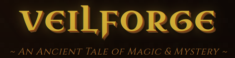

# 🏰 Veilforge: AI Adventure

**Veilforge: AI Adventure** is an immersive medieval fantasy text adventure game where your choices shape the story. Explore ancient ruins, battle dark forces, and uncover secrets as a Veilforged - one touched by the mystical energies of the Veil.

## ✨ Features

- **Dynamic AI Storytelling**: Every playthrough generates unique adventures
- **Rich Character Creation**: Choose from 5 races and 5 classes
- **4 Starting Realms**: Each with distinct themes and challenges
- **Medieval Atmosphere**: Authentic old English dialogue and styling
- **Character Progression**: Track health, experience, and Veil Energy
- **Responsive Design**: Play on desktop or mobile devices

## 🎮 How to Play

1. Clone this repository or download the `index.html` file
2. Open the file in any modern web browser
3. Create your character by selecting:
   - Noble Bloodline (race)
   - Sacred Calling (class)
   - Starting Realm
   - Character Name
4. Click "Begin thy Noble Quest" to start your adventure
5. Make choices by clicking the action buttons
6. Watch your stats change based on your decisions

## 🧙 Character Options

### Noble Bloodlines (Races):
- **Human**: Adaptable and ambitious
- **Elf**: Keepers of ancient wisdom
- **Dwarf**: Stout mountain defenders
- **Orc**: Fierce warriors
- **Vexling**: Mysterious shadow-walkers

### Sacred Callings (Classes):
- **Warrior**: Master of blade and shield
- **Mage**: Wielder of arcane mysteries
- **Rogue**: Keeper of secrets
- **Cleric**: Divine servant and healer
- **Beastcaller**: Friend to wild creatures

### Starting Realms:
- **The Shattered Spire**: Floating ruins of ancient sorcery
- **Ironhold**: Besieged dwarven fortress
- **The Whispering Woods**: Haunted forest of lost souls
- **The Ashen Wastes**: Cursed battlefield of fallen heroes

## 🛠️ Technologies Used

- Pure HTML, CSS, and JavaScript
- Google Fonts (Cinzel and Uncial Antiqua)
- CSS animations and gradients
- Responsive design principles

## 🌟 Future Enhancements

- [ ] Save/Load game functionality
- [ ] More character customization
- [ ] Additional realms and story branches
- [ ] Sound effects and music
- [ ] Mobile app version

## 📜 License

This project is licensed under the MIT License - see the [LICENSE](LICENSE) file for details.

## ⚔️ About the Developer

Created by [abdullahjalil] as a passion project combining medieval fantasy with interactive storytelling. Inspired by classic text adventures and tabletop RPGs.

---

**May thy blade stay sharp and thy Veil Energy never wane, brave adventurer!** ⚜️
